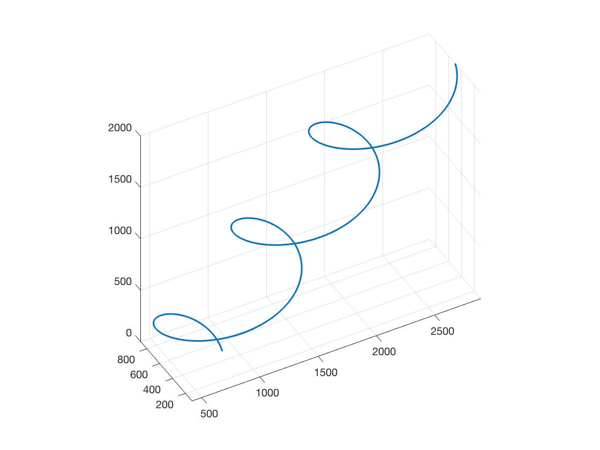

# aircraft-turn-wind

In no wind conditions an aircraft turning describes a perfect circle.
Interestingly, an airplane turning under the influence of wind describes a trochoid ([Techy2009]_).
This might be helpful for thermalling visualations.

## Prerequisites
Matlab
Mapping Toolbox (wrapTo2Pi is used)

## Example

## References
.. [Techy2009] Laszlo Techy;Craig A. Woolsey. (2009). "Minimum-Time Path Planning for Unmanned Aerial Vehicles in Steady Uniform Winds".
